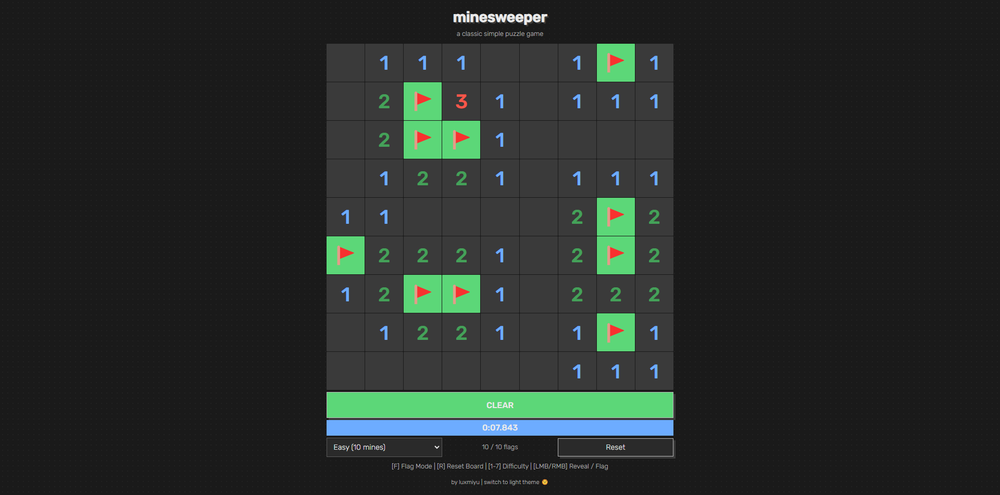

# Minesweeper

  

https://luxmiyu.com/minesweeper by luxmiyu

### Special Features
- Chording: Click on a cell whose number matches the flags around it, to reveal all unflagged cells.
- Smart Flagging: Click on a cell whose number matches the unrevealed cells around it, to flag all of them.

### Shortcuts
- `F`: Toggle flag mode
- `R`: Reset board
- `Shift+R`: Reset board and open the center
- `1-8`: Choose difficulty / Board size
- `C`: Open the center
- `A`: Start algorithm (Chording + Smart Flagging)
- `Shift+A`: Start algorithm (Chording + Smart Flagging + Guess)
- `Alt+A`: Start algorithm (Cheating)

